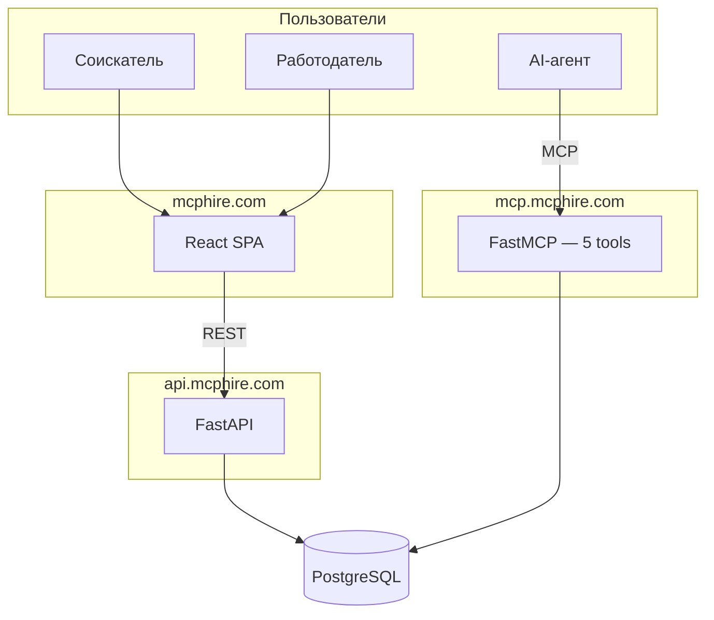

# MCPHire — MCP-first маркетплейс вакансий

MCP-native платформа для поиска работы в IT. Два входа — один продукт:
- **mcphire.com** — веб-интерфейс для соискателей и работодателей
- **mcp.mcphire.com** — MCP сервер для AI-агентов (Claude, GPT и др.)



## Стек

| Слой | Технологии |
|------|-----------|
| Frontend | React 18, TypeScript, Vite 5, Tailwind CSS, shadcn/ui, React Query 5 |
| Backend | FastAPI, SQLAlchemy 2.0 (async), asyncpg, PostgreSQL 16, Alembic |
| MCP | FastMCP, 5 инструментов (search_jobs, get_job_details, apply_to_job, get_my_applications, get_salary_stats) |
| Auth | JWT (HS256) + Telegram OAuth |
| Deploy | Docker Compose, Contabo VPS, Nginx |

## Быстрый старт

### Frontend
```bash
cd mcphire-frontend
npm install
cp .env.example .env    # VITE_USE_MOCKS=true для работы без бэкенда
npm run dev              # localhost:8080
```

### Backend
```bash
cd mcphire-mcp/backend
docker compose up -d     # PostgreSQL
pip install -r requirements.txt
uvicorn app.main:app --reload  # localhost:8000
```

### MCP сервер
```bash
cd mcphire-mcp
pip install -r requirements.txt
python server.py --test  # тест с mock данными
python server.py         # stdio режим для Claude
```

## Скрипты

| Команда | Описание |
|---------|----------|
| `npm run dev` | Dev-сервер с HMR (порт 8080) |
| `npm run build` | Production сборка |
| `npm run test` | Тесты (Vitest) |
| `npm run lint` | ESLint проверка |

## Структура проекта

```
mcphire-frontend/
├── src/
│   ├── components/    # UI компоненты (55+ shadcn/ui + кастомные)
│   ├── pages/         # 28 страниц (lazy-loaded)
│   ├── contexts/      # AuthContext (JWT, роли)
│   ├── lib/           # API клиент, утилиты, хуки
│   ├── types/         # TypeScript интерфейсы
│   └── data/          # Seed данные, статьи базы знаний
├── .wiki/             # GitHub Wiki (12 страниц документации)
└── public/            # Статика
```

## Документация

Полная документация проекта — в [GitHub Wiki](../../wiki):
- Архитектура фронтенда и бэкенда
- Схема базы данных (ER-диаграммы)
- Справочник API (27 endpoints)
- MCP сервер (5 инструментов)
- Деплой и инфраструктура
- Безопасность и аутентификация
- Бизнес-модель и дорожная карта

## Статус

- Этап 1 (MVP): завершена
- Спринты S14-S19 (данные + MCP production): в работе — [бэклог](../../wiki/Phase-2-Backlog)
