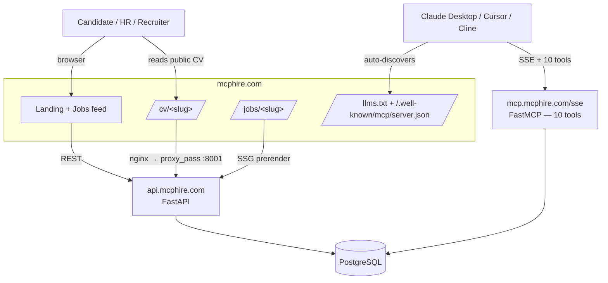

# mcphire-frontend

Публичный веб-интерфейс **MCPHire** — MCP-first job marketplace для России. React 18 SPA с SSG для 3 000+ вакансий + публичные CV-страницы кандидатов + agent-discovery манифест для AI-клиентов (Claude Desktop, Cursor, Cline).

**Backend:** [`TimmyZinin/mcphire-mcp`](https://github.com/TimmyZinin/mcphire-mcp) (FastAPI + FastMCP + 6 Docker services).

**Live:** https://mcphire.com · **Статус:** v1.3.0 (задеплоен 2026-04-21)

---

## Что делает

- 🏠 Landing + лента из 59 601 активной вакансии (HH / RemoteOK / Trudvsem / Habr Career)
- 📄 Публичные CV-страницы кандидатов: `/cv/<8-hex>` — рендерятся backend FastAPI через nginx regex-proxy
- 💼 Публичные job pages: `/jobs/<slug>` с Schema.org JobPosting JSON-LD (SEO)
- 🤖 Agent-discovery: `/llms.txt` (9-step onboarding protocol) + `/.well-known/mcp/server.json` (10 tools + endpoint) — чтобы Claude мог сам найти MCP-сервер по одной доменной подсказке
- 🎨 Homepage секция «Для AI-агентов» с готовым промптом для Claude



---

## Stack

| Слой | Технологии |
|---|---|
| UI | React 18, TypeScript, Vite 5, Tailwind CSS, shadcn/ui (55+ компонентов), Radix Primitives |
| State/data | React Query 5, Zustand, React Hook Form + Zod |
| Routing | React Router 6 (lazy-loaded, 26+ страниц) |
| Design | OKLCH color system, custom CSS variables, no dark theme, zc-* prefix утилиты |
| SSG | Custom prerenderer (cron 04:00 UTC) → 3 000+ статических job-pages |
| Deploy | rsync → Contabo VPS 30 `/opt/sborka-v2` → nginx serves static + regex-proxies `/cv/*` and `/employer/*` to backend |

---

## Quickstart

```bash
npm install
cp .env.example .env         # VITE_USE_MOCKS=true для работы без бэкенда
npm run dev                   # localhost:8080 с HMR
```

Build + deploy:
```bash
npm run build                 # → dist/
rsync -az --delete dist/ root@185.202.239.165:/opt/sborka-v2/
```

## Scripts

| Команда | Назначение |
|---|---|
| `npm run dev` | Dev-сервер с HMR (порт 8080) |
| `npm run build` | Production сборка в `dist/` |
| `npm run test` | Vitest unit tests |
| `npm run lint` | ESLint |

---

## Структура

```
mcphire-frontend/
├── src/
│   ├── components/       # 55+ shadcn/ui + кастомные
│   ├── pages/            # 26+ страниц (все lazy-loaded)
│   │   ├── HomePage.tsx       # landing + AI-agent onboarding section
│   │   ├── JobsListPage.tsx
│   │   ├── JobDetailPage.tsx
│   │   ├── CvPage.tsx         # SPA shell — HTML render приходит с backend
│   │   ├── MCPPage.tsx        # human-readable описание MCP API
│   │   └── ...
│   ├── contexts/         # AuthContext (JWT + Telegram OAuth)
│   ├── lib/              # API client, хуки, утилиты
│   ├── types/            # TypeScript интерфейсы для job/profile/application
│   └── data/             # seed data, knowledge base articles
└── public/
    ├── llms.txt                            # agent onboarding protocol (9 steps)
    ├── llms-full.txt                       # full version c tool schemas
    └── .well-known/mcp/server.json         # MCP discovery manifest (10 tools)
```

---

## Nginx routing (VPS)

Frontend статика из `/opt/sborka-v2/`. Для dynamic routes backend проксируется inline:

```nginx
# /cv/<8-hex> → backend CV renderer (backend/app/routers/cv.py)
location ~ "^/cv/[0-9a-f]{8}$" {
    proxy_pass http://127.0.0.1:8001;
    # ... (headers omitted)
}

# /employer/<slug> → backend employer page (S13)
location ~ "^/employer/[a-z0-9-]+$" {
    proxy_pass http://127.0.0.1:8001;
}

# Everything else — SPA fallback
location / {
    try_files $uri $uri/ /index.html;
}
```

---

## Documentation

Основная документация лежит в [`TimmyZinin/mcphire-mcp`](https://github.com/TimmyZinin/mcphire-mcp):

- [README](https://github.com/TimmyZinin/mcphire-mcp) — обзор всего продукта
- [GitHub Wiki](https://github.com/TimmyZinin/mcphire-mcp/wiki) — 5 страниц с Mermaid (Architecture / MCP API / Deployment / Changelog)
- [docs/ONBOARDING_CANDIDATES.md](https://github.com/TimmyZinin/mcphire-mcp/blob/main/docs/ONBOARDING_CANDIDATES.md)
- [docs/MCP_CLIENT_SETUP.md](https://github.com/TimmyZinin/mcphire-mcp/blob/main/docs/MCP_CLIENT_SETUP.md)

---

## License

Private repo, closed source. Контакт: Tim Zinin.
